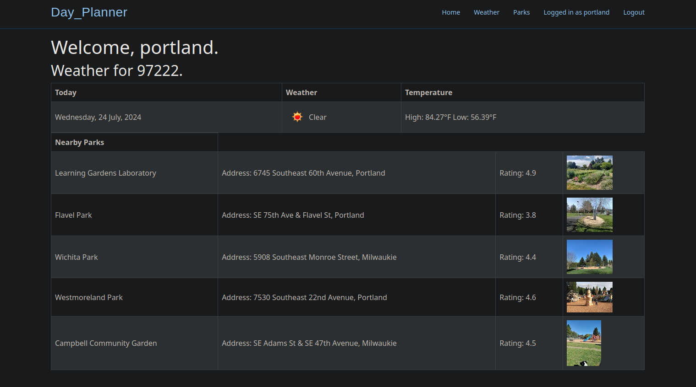
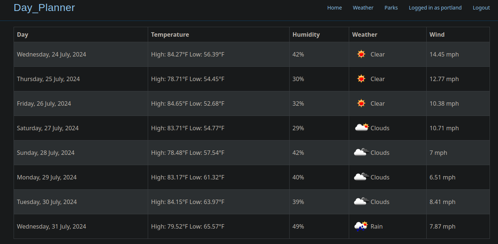
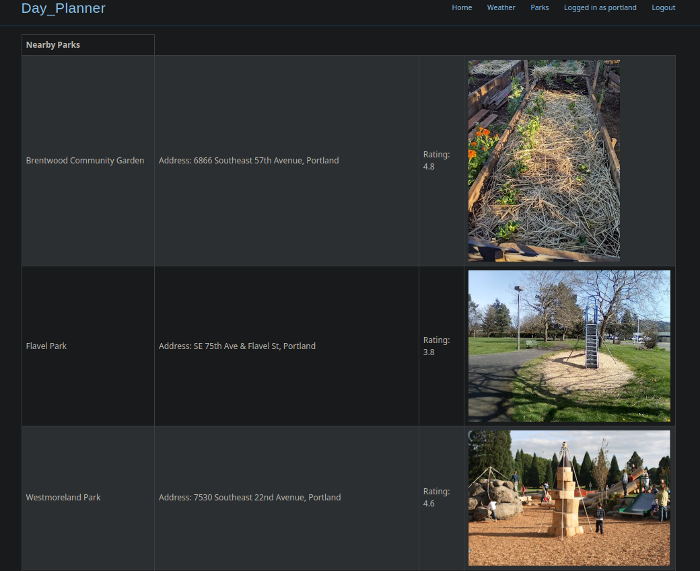
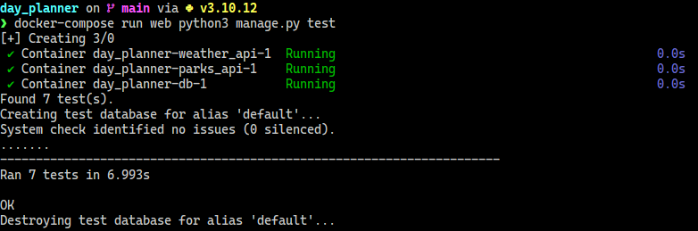

# Day Planner
Django app that shows weather and parks nearby via postal zip code to help with local adventures.

## Features
- Docker-compose dev environment that updates upon changes
- [Weather](https://github.com/Ramsey2022/planner_weather_api) and [Park](https://github.com/Ramsey2022/planner_parks_api) API’s are built with Flask and connected via Docker network
- Weather is acquired through OpenWeather API
- Parks are acquired through Google Places API
- Postgresql Docker database
- Flask API's tested with Pytest
- Django app tested with Django unit testing.
- Returns nearby parks data from a postal zipcode including:

  - Park name
  - Address
  - Rating
  - Picture
- Returns daily weather for the week from zipcode including:

  - Max/Min Temperatures
  - Humidity
  - Wind
  - Weather(rain etc)
  - Weather icon

# Demo

